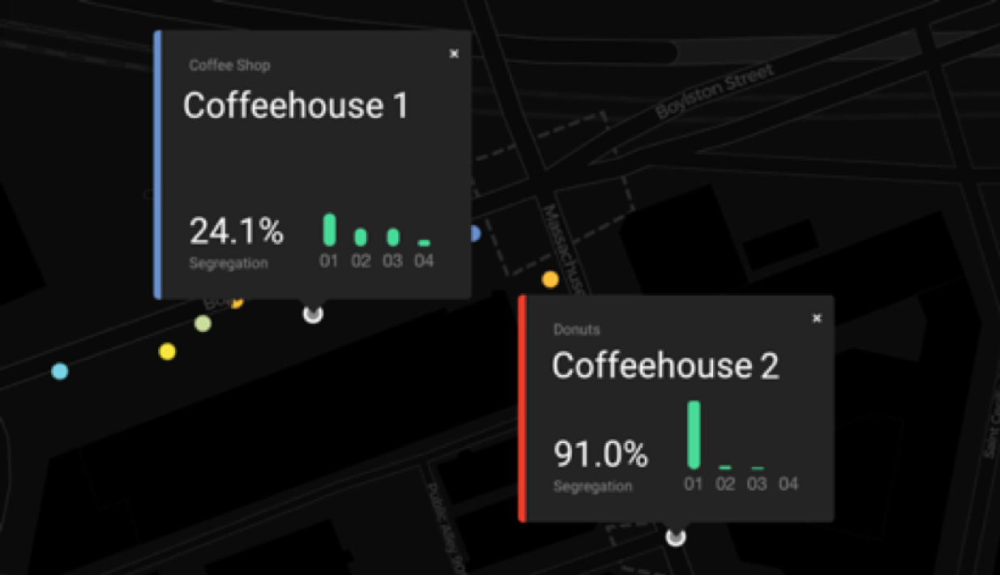

# Stories

Places with economically diverse visitors can be only a few feet away from places where only the wealthiest spend their time. The way we experience economic inequality in cities is impacted by where we go, not just by where we live.
When you want to grab a cup of coffee, where do you go? Does it depend on whether you’re at home or at work? How many other coffee shops do you pass on the way to your favorite spot?
We all have our own preferences and needs -- like choosing a latte or a simple cup of black coffee. When we head out into our cities and towns, we use our preferences to decide where to spend our time. Through these choices, we build our habits and routines.

The fact that our routines decide where we spend our time also means that they decide who we spend our time with. Although we may get our daily coffee on the same city block, the specific places we're in -- and the people around us -- can be radically different.

In Boston, like in other cities, coffee shops can occupy places as close as a few feet apart. The two coffee in the figure above are on the same city block. Although they are within 2 minute walk of one another, the incomes of the people who visit them are very different.

Coffeehouse 2 is visited almost exclusively by people we’ve identified as being in Boston’s lowest income bracket, while Coffeehouse 1 has visitors more representative of all incomes. The choice of which coffee shop to visit can contribute significantly to income segregation.

It’s important to note that these choices that people make are usually constrained by things like affordability, location, and social groups. But a place where people of all different incomes come together can be on the same block as a place where only the poorest -- or the wealthiest -- spend their time. This means that socio-economic inequality in cities is encoded in part by these choices, not just where people live.